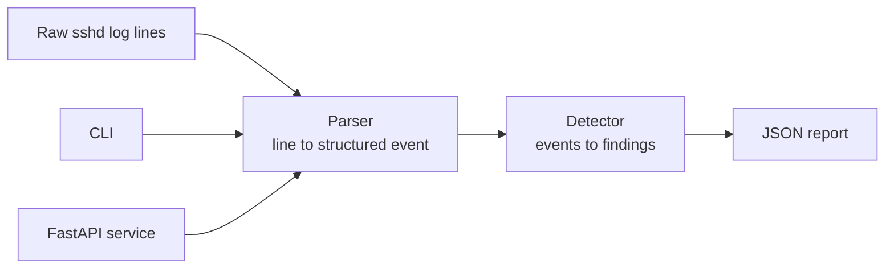

<!--
  README.md
-->

<p align="center">
  <!-- BADGES:START -->
  <a href="#"></a>
  <a href="#"></a>
  <a href="#"></a>
  <a href="#"></a>
  <a href="#"></a>
  <!-- BADGES:END -->
</p>

# access-audit-api

Author: Saina Kakkar

### Project Description
LogGuard is security log analysis for SSH authentication logs. You can use
it as a CLI for one-off audits or as a FastAPI service for continuous
monitoring.

It parses raw, noisy `sshd` auth logs, detects suspicious failed-login
patterns (brute-force attempts, and credential spraying across usernames),
and produces deterministic JSON reports that are safe to diff, alert on, or
feed into a dashboard.



The parser and the detector are separate, unit-tested pieces. The CLI and
the API are thin adapters over that same core, so the two interfaces cannot
drift apart in behavior. For a security tool I wanted the analysis to be
auditable in one place.

## Quick Start

1. **Set up the environment:**

   ```bash
   python -m venv .venv
   source .venv/bin/activate
   pip install -e ".[dev]"
   ```

2. **Analyze a sample log:**

   ```bash
   logguard analyze samples/auth.log --threshold 3 --out reports/auth-report.json
   ```

### Example Report

This is the actual output for the bundled sample log:

```json
{
  "total_lines": 8,
  "parsed_events": 7,
  "failed_logins": 5,
  "accepted_logins": 1,
  "suspicious_ips": [
    {
      "ip": "203.0.113.4",
      "failed_attempts": 3,
      "usernames": ["admin", "root"],
      "risk": "medium"
    }
  ]
}
```

Note `total_lines: 8` vs `parsed_events: 7`. One line in the sample is
garbage on purpose. The report tells you how much of the log the tool
actually understood, instead of pretending it saw everything.

## CLI Reference

The `analyze` subcommand options:

| Argument | Default | What it does |
|---|---|---|
| `logfile` | (required) | Path to an `auth.log`-style file |
| `--threshold` | `5` | Failed-login count per IP that counts as suspicious |
| `--year` | `2026` | Year to attach to syslog timestamps |
| `--out` | none | Write the JSON report to a file |

The `--year` flag exists because of a real syslog quirk: classic syslog
timestamps look like `Apr 26 12:00:00` and do not contain a year at all.
The parser has to attach one from somewhere, so it is explicit and
configurable instead of silently assuming.

## How the Risk Rating Works

Each suspicious IP gets a rating based on how far past the threshold it is:

| Rating | Condition (with `--threshold N`) |
|---|---|
| `low` | fewer than N failed attempts (not reported as suspicious) |
| `medium` | N or more failed attempts |
| `high` | 3×N or more failed attempts |

So in the example above, 3 failed attempts with `--threshold 3` lands
exactly on `medium`. With the default threshold of 5, the same IP would not
be flagged at all. There is no single right threshold: three failures from
one IP is suspicious on a small personal server and completely normal on a
busy one, which is why it is a flag and not a constant.

## Run as a Service

The same engine also runs behind FastAPI:

```bash
uvicorn logguard.api:app --reload
```

```bash
curl -X POST http://127.0.0.1:8000/analyze \
  -H "Content-Type: application/json" \
  -d '{"threshold": 2, "lines": ["Apr 26 12:00:00 vm sshd[10]: Failed password for root from 203.0.113.4 port 53122 ssh2"]}'
```

| Endpoint        | Description                                        |
| --------------- | -------------------------------------------------- |
| `GET /health`   | Service status                                     |
| `POST /analyze` | Analyze log lines; returns the same JSON report as the CLI |

## Docker

```bash
docker build -t logguard-api .
docker run -p 8000:8000 logguard-api
```

## Project Layout

```
src/logguard/
  parser.py     raw sshd line -> structured event (or counted as unparseable)
  detector.py   event stream -> suspicious IPs with risk ratings
  cli.py        the analyze subcommand
  api.py        FastAPI wrapper (GET /health, POST /analyze)
samples/        example auth.log with planted attack patterns
tests/          parser, detector, API, and CLI tests
```

## Verify

```bash
pytest
```

## Additional Notes

- My first parser raised an exception on any line it did not recognize,
  which meant one weird log line killed a whole audit. Real auth logs are
  full of lines that are not login events. Now unknown lines are counted and
  skipped, and the parsed vs. unparseable numbers go into the report.
- Credential spraying (one IP trying a few passwords across many usernames)
  is why each suspicious IP reports the list of usernames it targeted, not
  only a count. Two usernames from one IP, like `admin` and `root` in the
  example, is a different story than twenty failures on one account.

## License

MIT. See the [LICENSE](LICENSE) file.
